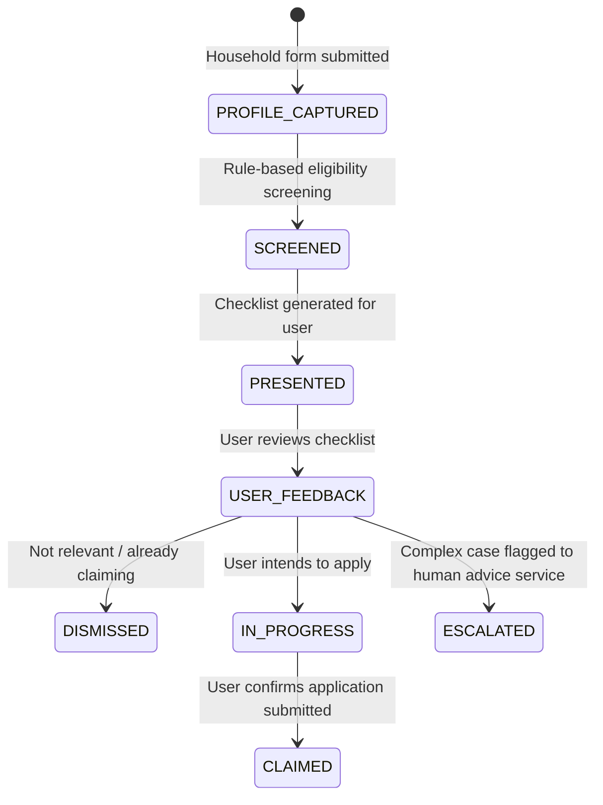

# Household Support Navigator

[](https://www.python.org/downloads/)
[](#architecture)
[](https://www.anthropic.com/)
[](tests/)
[](LICENSE.md)

> **One-Line Purpose:** Help UK households discover which benefits, grants, and bill-reduction schemes they may be entitled to — via deterministic rule-based screening, plain-language LLM explanation, and mandatory human-adviser escalation for complex cases.

Part of the **JigsawFlux** duty-of-care MVP portfolio, alongside `appointment-guardian`, `graduate-career-navigator`, and `verification-agent`.

---

## The Problem

> Full background, survey data, and feasibility analysis: [research.md](research.md)

### Cost of living is the largest untouched public concern in the JigsawFlux portfolio

From the ONS "Public Opinions and Social Trends" survey (June 2026):

| Concern | % of UK adults |
| --- | --- |
| **Cost of living** | **88%** — the single largest concern, untouched by any prior JigsawFlux MVP |
| NHS | 78% |
| The economy | 70% |
| Employment | 54% — addressed by Graduate Career Navigator |

### £23 billion in benefits goes unclaimed every year

Policy in Practice and DWP estimates put **unclaimed means-tested benefits at over £23 billion annually** across Pension Credit, Council Tax Reduction, Housing Benefit, and Universal Credit. Pension Credit alone has an estimated **880,000 eligible non-claimants** — each missing out not just on the benefit itself but on a cascade of passported entitlements (Winter Fuel Payment, free TV licence, NHS cost support).

The barriers are not lack of entitlement. They are:

1. **Fragmented discovery** — no single government service surfaces every entitlement a household qualifies for
2. **Invisible passported benefits** — most claimants don't know that claiming one benefit unlocks several others automatically
3. **Local scheme opacity** — Household Support Fund and Council Tax discretionary schemes vary by council and are poorly indexed
4. **Fear and mistrust** — households avoid means-tested claims due to stigma, complexity, or fear of it affecting other benefits (a common but often incorrect assumption)

### AI trust is at its lowest for financial and government decisions

From the same survey:

- Only **36%** of adults believe AI will personally benefit them; **27% disagree** — nearly double the figure from August 2025
- Trust in AI for **government decision-making: 4%**
- Trust in AI for **caregiving: 5%** — the two lowest-trust categories recorded
- **77%** worry about non-consensual data use

**Implication for this MVP:** any tool touching household finances or government entitlements must be radically transparent, advisory-only, and must never touch bank data or submit claims autonomously — the same governance model applied across all JigsawFlux duty-of-care MVPs.

---

## Key Features & Safety Principles

1. **Deterministic eligibility engine** — `src/rules/*.py` are pure functions returning a `RuleResult`. Eligibility is never determined by an LLM.
2. **LLM explains, not decides** — Claude rephrases rule engine output in plain, warm language, strictly bounded to the `reason` and `source_url` already computed.
3. **Mandatory escalation** — self-employed income, large households (5+), and low-confidence matches are always routed to Citizens Advice / MoneyHelper. This path cannot be bypassed.
4. **No financial data collection** — `reject_if_financial_data_present()` guards every input boundary. Bank account, sort code, IBAN, and card fields are refused at the schema level.
5. **No persistence without explicit consent** — sessions are in-memory by default. Disk persistence requires `HSN_STORAGE_CONSENT=true`.
6. **Deterministic fallback** — if the LLM call fails for any reason, a template-based explanation is generated automatically. The tool never blocks on an LLM failure.
7. **Signpost-only results** — discretionary local schemes (Household Support Fund) are rendered as signposts, not eligibility determinations, and never trigger the escalation path.

---

## Architecture

> Detailed C4 Model & Developer Extension Guide: [architecture.md](architecture.md)

### Core principle: rule engine decides, LLM explains


```text
HouseholdProfile → screen_household() → [RuleResult, ...]
                                              │
                        ┌─────────────────────┼─────────────────────┐
                        ▼                     ▼                     ▼
              explain_results()   detect_complex_case()    build_checklist()
                (src/explainer)      (src/escalation)         (src/renderer)
                                              │                     │
                                              ▼                     ▼
                                render_escalation_message()   render_cli() / render_html()
```

### Agentic state machine



- **PROFILE_CAPTURED** — income, household size, region, existing benefits (self-reported, session-only, no bank data)
- **SCREENED** — deterministic rule engine; not LLM-guessed
- **PRESENTED** — prioritised checklist with rule reasoning and official application links
- **ESCALATED** — complex cases (self-employment, immigration status, large households) routed to Citizens Advice / MoneyHelper — never resolved by the agent

### Entitlement rules covered

| Rule module | Entitlement | Trigger |
| --- | --- | --- |
| `pension_credit.py` | Pension Credit | Age ≥ 66 + income ≤ guarantee threshold |
| `council_tax_reduction.py` | Council Tax Reduction | Income ≤ per-household-size band |
| `warm_home_discount.py` | Warm Home Discount | Qualifying benefit or low income |
| `healthy_start.py` | Healthy Start | Qualifying benefit + pregnancy or child under 4 |
| `household_support_fund.py` | Household Support Fund | Signpost — discretionary, varies by council |

### Escalation triggers

| Trigger | Reason |
| --- | --- |
| `self_employed` | Self-employed income cannot be reliably screened by simplified rules |
| `large_household` | Households of 5+ often qualify for thresholds not modelled here |
| `low_confidence_match` | Eligible result with `low` or `needs_review` confidence |

---

## Data Sources

| Source | Access | Coverage | Feasibility |
| --- | --- | --- | --- |
| **GOV.UK published guidance** | Public, open licence | Pension Credit, CTR, Universal Credit thresholds | **High** — primary rule source; stable and openly licensed |
| **Turn2us Benefits Calculator** | Partner API | Broad, including grants and charitable funds | **Medium** — strong coverage, needs partnership agreement for production |
| **entitledto** | Commercial API | Comprehensive, industry-standard | **Medium** — high quality, licensing cost to evaluate post-MVP |
| **Local authority HSF pages** | Public, per-council HTML | Local grants and discretionary schemes | **Medium** — start with 3–5 pilot councils; requires lightweight normalisation |
| **MoneyHelper / Citizens Advice** | Public | Signposting and complex case escalation | **High** — safe fallback layer, always available |

*This MVP uses GOV.UK published guidance as its primary rule source. The other sources are candidates for future expansion — see [research.md §4](research.md) for the full feasibility analysis.*

---

## Setup

### 1. Requirements

Python 3.9 or later.

```bash
python3 -m venv .venv
source .venv/bin/activate
pip install -r requirements.txt
```

### 2. Configure environment

```bash
cp .env.example .env
```

Edit `.env`:

| Variable | Required | Description |
| --- | --- | --- |
| `ANTHROPIC_API_KEY` | Yes (default provider) | [console.anthropic.com](https://console.anthropic.com) |
| `CLAUDE_MODEL` | No | Override the Claude model. Default: `claude-sonnet-4-6` |
| `LLM_PROVIDER` | No | `anthropic` (default) or `ollama` |
| `OLLAMA_MODEL` | Ollama only | Model name. Default: `llama3.1:8b` |
| `OLLAMA_BASE_URL` | Ollama only | Default: `http://localhost:11434` |
| `HSN_STORAGE_CONSENT` | No | Set `true` to enable optional session persistence to disk |

### 3. Run tests

```bash
pytest -q
# 57 passed in <1s
```

---

## Running

### End-to-end smoke test

`run_e2e.py` exercises the full pipeline for two sample households and writes CLI output, HTML output, and LLM explanations to `data/e2e_output/`:

```bash
python3 run_e2e.py
```

Example output:

```text
Running e2e test — model: claude-sonnet-4-6

--- pensioner_low_income ---
  Rules run: 5  |  Escalation triggers: 0
  LLM calls: 1  |  Latency: 18.10s
  Saved: pensioner_low_income_<ts>.txt, pensioner_low_income_<ts>.html, pensioner_low_income_<ts>_explanation.txt

--- young_family ---
  Rules run: 5  |  Escalation triggers: 0
  LLM calls: 1  |  Latency: 18.07s
  Saved: young_family_<ts>.txt, young_family_<ts>.html, young_family_<ts>_explanation.txt

Telemetry: telemetry_<uuid>.json
```

### Sample CLI checklist

```text
Household Support Navigator — Your Checklist
============================================

✅ You may qualify: Pension Credit
  Why: Household income (£10,500) is at or below the Pension Credit guarantee
       threshold (£11,960).
  Confidence: medium
  More info: https://www.gov.uk/pension-credit/eligibility

✅ You may qualify: Council Tax Reduction
  Why: Household income (£10,500) is at or below the illustrative CTR
       threshold (£16,000) for this household size.
  Confidence: medium
  More info: https://www.gov.uk/apply-council-tax-reduction

ℹ️ Check locally: Household Support Fund
  More info: https://www.gov.uk/cost-of-living/find-help-in-your-area
```

---

## Key Files

| File | Role |
| --- | --- |
| `src/household_profile.py` | `HouseholdProfile` dataclass + validation. `reject_if_financial_data_present()` guards all input boundaries. |
| `src/rules/engine.py` | Registers all rule modules; `screen_household()` runs them deterministically with per-rule fault isolation. |
| `src/rules/*.py` | One pure function per entitlement returning a frozen `RuleResult`. |
| `src/explainer.py` | LLM-based plain-language explanation + document checklist. Falls back to a template on LLM failure. |
| `src/escalation.py` | `detect_complex_case()` — flags self-employment, large households, and low-confidence matches for human-adviser routing. |
| `src/renderer.py` | `build_checklist()` sorts results (eligible-high-confidence first); `render_cli()` / `render_html()` produce output. |
| `src/session_store.py` | In-memory by default. `persist_to_disk()` requires `HSN_STORAGE_CONSENT=true` and rejects financial fields. |
| `shared/llm.py` | LLM factory — `get_llm()` reads `LLM_PROVIDER` and returns the appropriate LangChain chat model. |
| `shared/telemetry.py` | Tracks `run_id`, latency, entitlement hit counts, and escalation rate per run. |

---

## Project Roadmap

| Milestone | Scope | Status |
| --- | --- | --- |
| **M0** Foundation | Project skeleton, config contract | Done |
| **M1** Data Model | `HouseholdProfile` dataclass + validation | Done |
| **M2** Rule Engine | Pension Credit, CTR, WHD, Healthy Start, HSF | Done |
| **M3** Explanation Layer | Plain-language LLM explainer + document guidance | Done |
| **M4** Escalation & Safety | Complex-case detector + escalation output | Done (immigration status trigger pending) |
| **M5** Output / UX | CLI + HTML checklist renderer | Done |
| **M6** Privacy & Data Controls | Session-only storage + consent gate | Done |
| **M7** Telemetry | Per-run metrics, weekly review export | Done |
| **M8** Test Suite | Unit + scenario tests (57 passing) | Done |
| **M9 — Pre-pilot** | Verify GOV.UK thresholds · Expand pilot council links · Go/No-Go checklist | In progress |

---

## Governance Hard Limits

These constraints are structural and must not be removed:

1. **No autonomous claim submission** — the agent produces a checklist with official links only; a human always submits.
2. **No financial/bank data collection** — enforced by `reject_if_financial_data_present()` in both `household_profile.py` and `session_store.py`.
3. **Eligibility is rule-based, not LLM-guessed** — `explainer.py` may only rephrase `RuleResult` fields already computed by the rule engine.
4. **Complex cases always escalate** — `detect_complex_case()` must never be bypassed for self-employment, large households, or low-confidence matches.
5. **No persistence without explicit consent** — `HSN_STORAGE_CONSENT=true` is required; defaults to session-only/in-memory.

---

## Known Pre-Pilot Limitations

Rule thresholds in `src/rules/*.py` are illustrative approximations of GOV.UK guidance, not verified current-year figures. Before any pilot use:

- Reconcile Pension Credit thresholds against current DWP guarantee credit rates (`pension_credit.py`)
- Reconcile Council Tax Reduction income bands against current per-council guidance (`council_tax_reduction.py`)
- Reconcile Warm Home Discount low-income threshold (`warm_home_discount.py`)
- Verify and expand pilot council links in `household_support_fund.py` (currently Manchester, Birmingham, Leeds placeholders only)

---

## License

MIT — see [LICENSE.md](LICENSE.md).

*Part of the JigsawFlux open-source suite for health tech, humanitarian response, and digital duty-of-care.*
