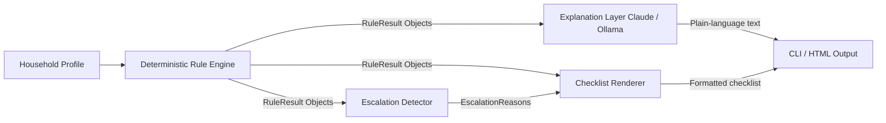
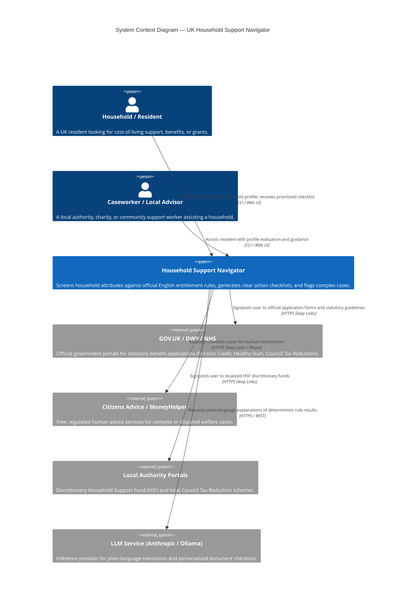
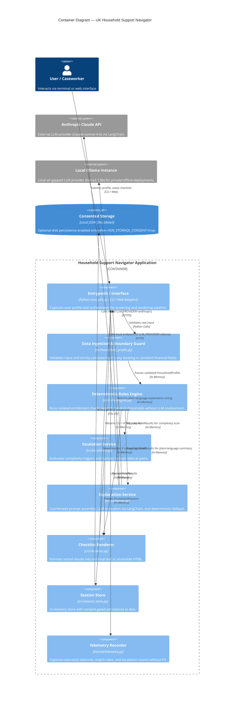
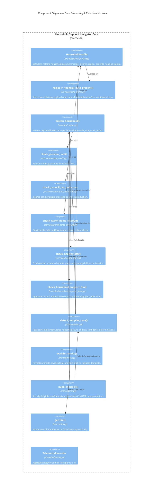
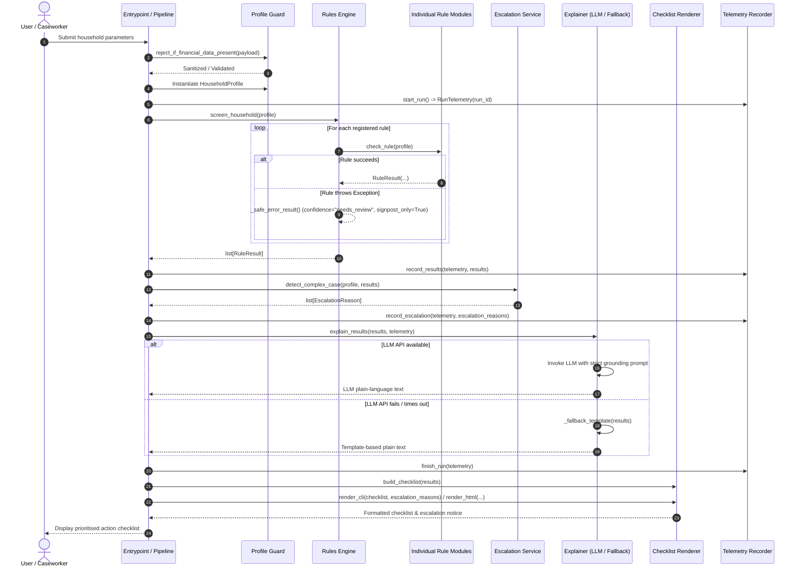
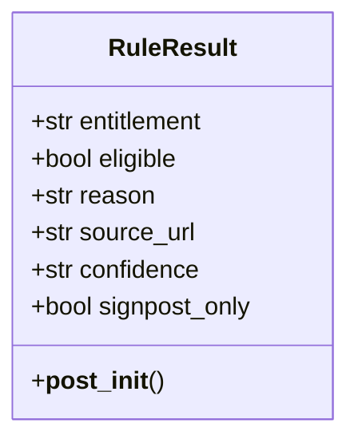
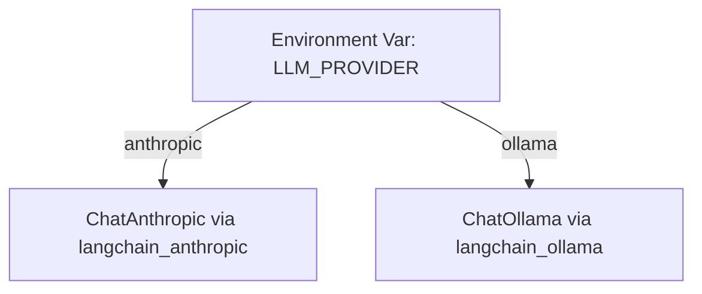

# UK Household Support Navigator — Technical Architecture Guide

> **Audience:** Software Engineers, Solution Architects, Local Authority Technical Teams, and Open Source Contributors seeking to adopt, configure, or extend the UK Household Support Navigator.

---

## 1. Architectural Overview & Design Philosophy

The **Household Support Navigator** is built on a fundamental architectural tenet: **Deterministic Rule Engines decide; Large Language Models explain; Human Advisers resolve edge cases.**



### Core Architecture Tenets

1. **Deterministic Eligibility (No AI Hallucination):** Entitlement eligibility is calculated exclusively via pure, unit-tested Python rule functions. An LLM is never permitted to make, modify, or override an eligibility calculation.
2. **Strict LLM Boundary:** The LLM's role is strictly confined to plain-language translation and document checklists based on computed `RuleResult` objects. If the LLM provider fails, times out, or returns an empty response, the system seamlessly falls back to pre-compiled deterministic templates.
3. **Duty-of-Care & Human Escalation:** Any complex scenario (e.g. self-employment, large households, low-confidence rules) triggers mandatory escalation signposting to regulated human advice services (Citizens Advice, MoneyHelper).
4. **Zero-Trust Privacy & Anti-Surveillance:** Input payloads are strictly filtered to reject financial credentials (bank accounts, sort codes, card numbers, IBANs). Storage is ephemeral/in-memory by default; disk persistence requires explicit opt-in consent (`HSN_STORAGE_CONSENT=true`).

---

## 2. C4 Model Architecture

### 2.1 Level 1: System Context Diagram

The System Context diagram illustrates how the Household Support Navigator fits into the broader UK welfare and digital advice ecosystem.



---

### 2.2 Level 2: Container Diagram

The Container diagram illustrates the runtime components, data boundaries, and third-party integrations.



---

### 2.3 Level 3: Component Diagram (Core Processing Pipeline)

The Component diagram details the internal structural decomposition of `src/` and `shared/`.



---

## 3. Data Flow & Sequence Diagram

This sequence diagram illustrates the lifecycle of a screening request from input to rendered checklist and telemetry export.



---

## 4. Extension & Adoption Guide

The Household Support Navigator is intentionally modular. Below are practical guides for extending the platform.

### 4.1 Extension Point 1: Adding a New Entitlement Rule

All rules must implement a standard signature and return an immutable `RuleResult` object.



#### Step 1: Create the rule module in `src/rules/`
Create a new file, e.g., `src/rules/attendance_allowance.py`:

```python
# src/rules/attendance_allowance.py
from src.household_profile import HouseholdProfile
from src.rules.base import RuleResult

_SOURCE_URL = "https://www.gov.uk/attendance-allowance/eligibility"
_MIN_AGE = 66

def check_attendance_allowance(profile: HouseholdProfile) -> RuleResult:
    """
    Evaluates potential eligibility for Attendance Allowance (disability/care need for State Pension age).
    """
    if profile.age < _MIN_AGE:
        return RuleResult(
            entitlement="Attendance Allowance",
            eligible=False,
            reason=f"Applicant must be State Pension age ({_MIN_AGE}+).",
            source_url=_SOURCE_URL,
            confidence="high",
        )

    # If your profile tracks disability or health conditions:
    return RuleResult(
        entitlement="Attendance Allowance",
        eligible=True,
        reason="Applicant meets the age threshold. If you have a physical or mental disability requiring care, you may claim.",
        source_url=_SOURCE_URL,
        confidence="medium",
    )
```

#### Step 2: Register the rule in `src/rules/engine.py`

```python
# In src/rules/engine.py
from src.rules.attendance_allowance import check_attendance_allowance

_RULES = (
    check_pension_credit,
    check_council_tax_reduction,
    check_warm_home_discount,
    check_healthy_start,
    check_household_support_fund,
    check_attendance_allowance,  # <-- Added here
)
```

#### Step 3: Add document guidance in `src/explainer.py`

```python
# In src/explainer.py _DOCUMENT_HINTS
_DOCUMENT_HINTS = {
    # ...
    "Attendance Allowance": [
        "National Insurance number",
        "GP / specialist contact details",
        "List of medications and care requirements",
    ],
}
```

#### Step 4: Write unit tests in `tests/`
Create `tests/test_attendance_allowance.py` covering:
- Eligible boundary case
- Ineligible boundary case
- Source URL presence and confidence validation

---

### 4.2 Extension Point 2: Supporting Local Council Schemes (Discretionary Funds)

Councils administer their own localized Household Support Fund allocations and Council Tax Support bands.

To add new local authorities:
1. Update `_PILOT_COUNCIL_LINKS` in `src/rules/household_support_fund.py`:
   ```python
   _PILOT_COUNCIL_LINKS = {
       "manchester": "https://www.manchester.gov.uk/householdsupportfund",
       "birmingham": "https://www.birmingham.gov.uk/householdsupportfund",
       "leeds": "https://www.leeds.gov.uk/householdsupportfund",
       "newcastle": "https://www.newcastle.gov.uk/householdsupportfund",
       "bristol": "https://www.bristol.gov.uk/householdsupportfund",
   }
   ```
2. When configuring for production, migrate these lookups into an external configuration file (e.g. `configs/councils.json`) to allow non-developer caseworkers to update links without touching code.

---

### 4.3 Extension Point 3: Adding Custom Escalation Triggers

Complex circumstances that cannot be accurately determined by deterministic rule thresholds must escalate to human advisers.

To add a new trigger (e.g., **No Recourse to Public Funds / Immigration Status** or **Disputed Claim History**):

1. Add the field to `HouseholdProfile` in `src/household_profile.py`:
   ```python
   @dataclass
   class HouseholdProfile:
       # ...
       has_recourse_to_public_funds: bool = True
   ```
2. Update `detect_complex_case()` in `src/escalation.py`:
   ```python
   if not profile.has_recourse_to_public_funds:
       reasons.append(
           EscalationReason(
               code="nrpf_status",
               description=(
                   "Your immigration status indicates No Recourse to Public Funds (NRPF). "
                   "Specialist advice from an immigration and welfare adviser is required before applying."
               ),
           )
       )
   ```

---

### 4.4 Extension Point 4: Switching LLM Providers

The framework supports switching inference providers via environment variables without code modification:



#### Running with Anthropic Claude (Cloud Default)
```bash
export LLM_PROVIDER=anthropic
export ANTHROPIC_API_KEY="your-api-key"
export CLAUDE_MODEL="claude-sonnet-4-6"
```

#### Running with Ollama (Local Air-Gapped / Privacy-Preserving)
```bash
export LLM_PROVIDER=ollama
export OLLAMA_MODEL="llama3.1:8b"
export OLLAMA_BASE_URL="http://localhost:11434"
```

---

### 4.5 Extension Point 5: Exposing as a REST / FastApi Service

To deploy the navigator as a backend service for a web portal or caseworker frontend:

```python
# example_api.py (Conceptual Integration)
from fastapi import FastAPI, HTTPException
from pydantic import BaseModel
from src.household_profile import HouseholdProfile, reject_if_financial_data_present
from src.rules.engine import screen_household
from src.escalation import detect_complex_case
from src.explainer import explain_results
from src.renderer import build_checklist

app = FastAPI(title="Household Support Navigator API")

@app.post("/api/v1/screen")
async def screen_endpoint(raw_payload: dict):
    # 1. Zero-trust financial guard
    try:
        reject_if_financial_data_present(raw_payload)
        profile = HouseholdProfile(**raw_payload)
    except Exception as exc:
        raise HTTPException(status_code=422, detail=str(exc))

    # 2. Deterministic screening
    results = screen_household(profile)
    
    # 3. Escalation check
    escalations = detect_complex_case(profile, results)
    
    # 4. Plain-language explanation
    explanation = explain_results(results)
    
    # 5. Checklist output — asdict() required: ChecklistItem and EscalationReason are frozen dataclasses
    import dataclasses
    checklist = build_checklist(results)

    return {
        "checklist": [dataclasses.asdict(item) for item in checklist],
        "escalations": [dataclasses.asdict(r) for r in escalations],
        "explanation": explanation,
    }
```

---

## 5. Security, Governance & Verification

| Pillar | Governance Mechanism | Verification Method |
| :--- | :--- | :--- |
| **No Financial Data Storage** | `reject_if_financial_data_present()` blocks banking terms | `tests/test_profile.py::test_rejects_bank_fields_in_raw_payload` |
| **Deterministic Eligibility** | Pure rule functions return frozen `RuleResult` | `tests/test_rules_extended.py`, `tests/test_pension_credit.py` |
| **No AI Hallucinations** | Grounding system prompt & `_fallback_template` on failure | `tests/test_explainer.py::test_explain_results_falls_back_on_llm_failure` |
| **Mandatory Escalation** | `detect_complex_case()` checks self-employment & household size | `tests/test_escalation.py::test_escalates_self_employed` |
| **Consent-gated Persistence**| `SessionStore.persist_to_disk` checks `HSN_STORAGE_CONSENT=true` | `tests/test_session_store.py::test_persist_raises_without_consent` |
| **Fault Isolation** | `screen_household` catches per-rule exceptions without crashing | `tests/test_rules_engine_robustness.py::test_screen_household_isolates_failing_rule` |

---

## 6. Running Tests & Validation

```bash
# Activate virtual environment
source .venv/bin/activate

# Execute all unit and integration tests
pytest -v

# Run the end-to-end smoke test pipeline
python3 run_e2e.py
```
