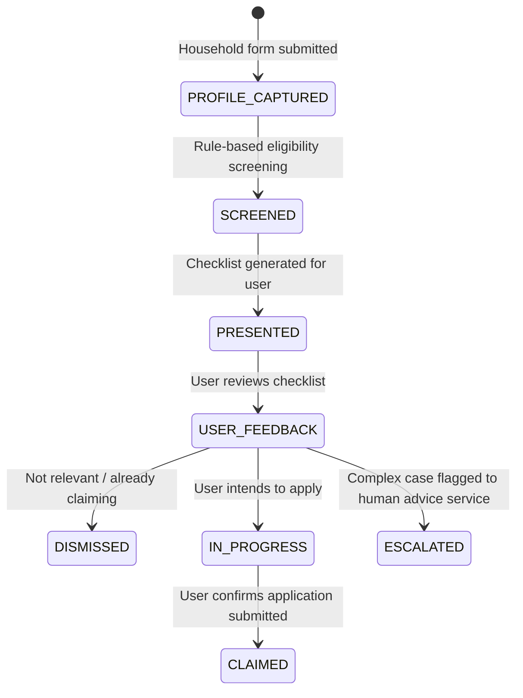

# UK Household Support Navigator: Background Research & Feasibility Study

This document details the background research, market context, and product feasibility analysis for the **UK Household Support Navigator**—a duty-of-care-focused, agentic tool designed to help UK households identify and safely claim unclaimed benefits, grants, and bill-reduction schemes amid record cost-of-living pressure.

---

## 1. Market Context & Public Sentiment Analysis

Drawn from the same ONS "Public Opinions and Social Trends" survey (fielded June 3–28, 2026) used in the Graduate Career Navigator research.

### 1.1 Leading Public Concerns
* **Cost of Living:** Remains the dominant concern for **88%** of the population — the single largest untouched theme across JigsawFlux's MVP portfolio to date.
* **NHS:** 78% (declining from 87% in June 2024).
* **The Economy:** 70%.
* **Employment:** 54% (historic high, already addressed by Graduate Career Navigator).

### 1.2 Public Trust in AI (carried over from prior research)
* Only 36% of adults believe AI will personally benefit them; 27% disagree — nearly double August 2025's 20%.
* Trust in AI for **government decision-making is 4%**, and for **caregiving is 5%** — the two lowest-trust categories recorded.
* 81% worry about distinguishing real from fake information online; 77% worry about non-consensual data use.

**Implication for this MVP:** any tool touching household finances or government entitlements must be radically transparent, advisory-only, and never touch bank data or submit claims autonomously — mirroring the trust constraints already respected in Appointment Guardian and Graduate Career Navigator.

---

## 2. The UK Unclaimed Benefits Problem

### 2.1 Scale of the Problem
* Policy in Practice and DWP estimates place **unclaimed means-tested benefits at over £23 billion annually** across Pension Credit, Council Tax Reduction, Housing Benefit, and Universal Credit.
* Pension Credit alone has an estimated **880,000 eligible non-claimants** (DWP, 2024 baseline), missing out on both the benefit itself and passported entitlements (Winter Fuel Payment, free TV licence, NHS costs).
* Local Household Support Fund allocations are announced per-council, often with poor public awareness and short application windows.

### 2.2 Core Friction Points for Households
1. **Entitlement discovery is fragmented** — no single government service surfaces every entitlement a household qualifies for.
2. **Passported benefits are invisible** — most claimants don't know that claiming one benefit unlocks several others.
3. **Local scheme opacity** — Household Support Fund and Council Tax discretionary schemes vary by council and are poorly indexed.
4. **Fear and mistrust** — households avoid means-tested claims due to stigma, complexity, or fear of it affecting other benefits (a common, often incorrect, assumption).

---

## 3. Product Concept: The Household Support Navigator

### 3.1 Core Value Proposition
* **Honest entitlement mapping:** Given a household profile, the agent identifies plausible entitlements and explains *why*, citing the official rule that triggered the match.
* **Radical transparency:** Every recommendation shows the qualifying rule and a link to the official government or council source — never a guess.
* **No autonomous submission:** The agent never submits a claim, stores bank details, or acts as a benefits calculator of legal record. It signposts to the official calculator/application and to free, regulated advice (Citizens Advice, MoneyHelper) for complex cases.

### 3.2 State Machine Architecture

* **PROFILE_CAPTURED:** Income, household size, region, existing benefits (self-reported, session-only).
* **SCREENED:** Deterministic rule engine checks against known entitlement thresholds — not LLM-guessed.
* **PRESENTED:** Prioritized checklist with reasoning, deadlines, and official links.
* **ESCALATED:** Complex/ambiguous cases (self-employment, multiple households, immigration status) routed to Citizens Advice / MoneyHelper — never resolved by the agent itself.

---

## 4. Data Source Feasibility Analysis

| Source | Access Type | Coverage | Feasibility / Recommendation |
| :--- | :--- | :--- | :--- |
| **GOV.UK Benefits rules (published guidance, open licence)** | Public | Pension Credit, Council Tax Reduction, Universal Credit thresholds | **High:** Primary rule source; content is openly licensed and stable. |
| **Turn2us Benefits Calculator** | Partner API (approval likely required) | Broad, including grants/charitable funds | **Medium:** Strong coverage but needs a partnership agreement before production use. |
| **entitledto** | Commercial/licensed API | Comprehensive, industry-standard | **Medium:** High quality but licensing cost — evaluate post-MVP. |
| **Local authority Household Support Fund pages** | Public, per-council, unstructured HTML | Local grants and discretionary schemes | **Medium:** Requires lightweight per-council normalization; start with 3–5 pilot councils. |
| **MoneyHelper / Citizens Advice content** | Public | Signposting only | **High:** Safe fallback layer for escalation and complex cases. |

---

## 5. MVP Scope & Implementation Plan (1–2 Days)

### 5.1 Technology Stack
* **Rule engine:** Deterministic Python rules for the top 5–6 highest-value entitlements (Pension Credit, Council Tax Reduction, Warm Home Discount, Healthy Start, Household Support Fund signposting).
* **Inference layer:** Anthropic Claude API used **only** for plain-language explanation and document-gathering guidance — never for eligibility decisions.
* **Storage & UI:** Session-only local JSON state; CLI or lightweight local HTML output — no persistent storage of financial data by default.

### 5.2 Day-by-Day Plan

**Day 1 — Rule Engine & Data Model**
1. Define `HouseholdProfile` dataclass (income, age, household size, region, existing benefits, housing status).
2. Implement deterministic eligibility rules for top entitlements with citation to official source per rule.
3. Build the state machine (`PROFILE_CAPTURED → SCREENED → PRESENTED`).

**Day 2 — Explanation Layer & Escalation**
1. Claude generates plain-language "why you may qualify" text bound strictly to the rule engine's output (no independent eligibility claims).
2. Implement `ESCALATED` path for ambiguous cases with Citizens Advice / MoneyHelper signposting.
3. Output a prioritized checklist (CLI or static HTML) with deadlines and official application links.

---

## 6. Governance & Ethical Guardrails

Consistent with the duty-of-care paradigm established across JigsawFlux MVPs (Appointment Guardian, Graduate Career Navigator, Verification Agent):

1. **No autonomous claims or submissions** — the agent never applies for a benefit on the user's behalf.
2. **No financial/bank data collected or stored** — session-only household profile, local-first, no persistence by default.
3. **Eligibility decisions are rule-based, not LLM-guessed** — Claude explains, it does not decide.
4. **Always signposts to regulated advice** (Citizens Advice, MoneyHelper) for complex or disputed cases.
5. **Radical transparency** — every recommendation cites the specific rule and official source that triggered it.